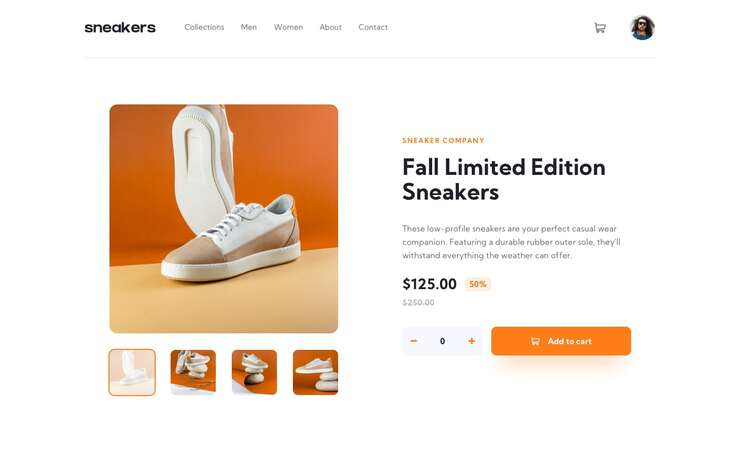
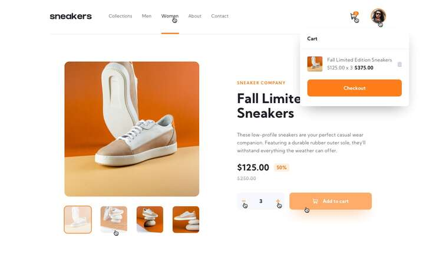
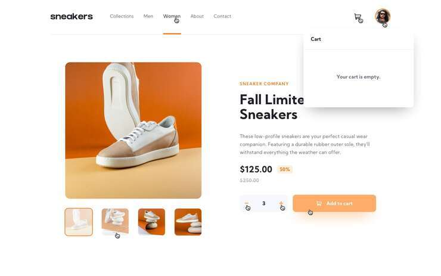
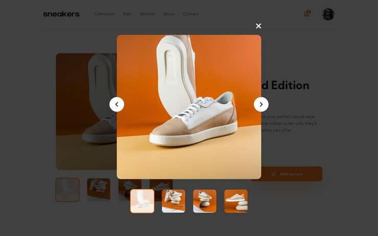
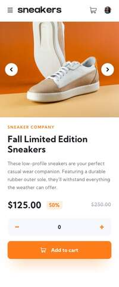
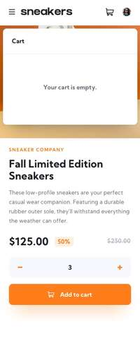
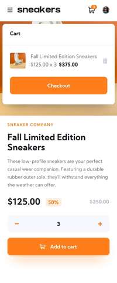
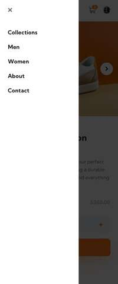

# Sneakers E-commerce Product Page

Esta é uma solução para o desafio [Sneakers E-commerce Product Page](https://www.frontendmentor.io/challenges/ecommerce-product-page-UPsZ9MJp6) do Frontend Mentor.

## Índice

- [Autor](#autor)
- [Sobre o projeto](#sobre-o-projeto)
  - [O desafio](#o-desafio)
  - [Design](#design)
    - [Desktop](#desktop)
    - [Mobile](#mobile)
- [Tecnologias](#tecnologias)
- [Solução desenvolvida](#solução)
- [Como executar](#como-executar)

## Autor

- Linkedin - [Jhony Vill da Silva](https://www.linkedin.com/in/jhony-vill-da-silva-390239210)

## Sobre o projeto

### O desafio

O desafio consiste no desenvolvimento de uma página de produto para e-commerce, sendo que os usuários devem ser capazes de:

- Abrir uma galeria de imagens em uma lightbox ao clicar na imagem grande do produto.
- Trocar a imagem grande do produto ao clicar nas miniaturas.
- Adicionar itens ao carrinho.
- Visualizar o carrinho e remover itens dele.
- Ver o layout ideal do site de acordo com o tamanho da tela de seus dispositivos.
- Ver os estados de foco ao passar o mouse sobre todos os elementos interativos na página.

### Design

Abaixo há imagens do design proposto por Frontend Mentor para o desafio.

#### Desktop

Tela inicial:



Estados ativos:




Modal para fotos do produto:



#### Mobile

Tela inicial:



Carrinho de compras:




Menu:



## Solução

- Acessar solução desenvolvida: [em desenvolvimento...]

## Como executar

### Antes de tudo, você precisa ter instalado:

1.  [Git](https://git-scm.com/downloads)
2.  [Node](https://nodejs.org/en/download)

#### Clonando o projeto

```
git clone https://github.com/jhonyvill/sneakers-ecommerce.git
```

#### Executando o projeto

1. Com o projeto clonado, entrar no respectivo diretório:

```
cd sneakers-ecommerce/
```

E em seguida instalar as dependências:

```
npm install
```

ou

```
pnpm install
```

Caso prefira usar o pnpm, mas não possui instalado na sua máquina, você pode instalar conforme indica o [site oficial](https://pnpm.io/pt/installation)

2. Executar o projeto com:

```
npm run dev
```

ou

```
pnpm run dev
```

Em seguida, basta abrir no navegador de sua preferência o link fornecido no terminal.

## Tecnologias

### Desenvolvido com:

- JavaScript
- React
- Vite
- Styled-Components
